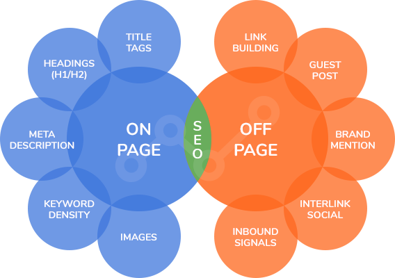

# SEO (Search Engine Optimization)

  - É a otimização para motores de busca
  - Páginas HTML aparecendo nas pesquisas
  - SEO é um conjunto de técnicas e práticas que melhoram o posicionamento de um site ou conteúdo na internet. 
  - Isso é importante para aumentar o tráfego do seu site, garantindo que as pessoas encontrem as informações relacionadas ao seu negócio. 
  - Um site bem posicionado nos resultados de busca é mais visível para os clientes e pode aumentar as vendas. 
  - O SEO é essencial para os desenvolvedores, pois mesmo que o site esteja bem construído, se não for encontrado, não adianta.
  - SERP(Search Engine Result Page) - Página de resultados do motor de busca 

## Otimização
  - Fatores que definem uma boa otimização
    - `On-page` 
      É tudo que está dentro da página, que temos controle.
      - Técnico(Dev)
      - Conteúdo(Copywriter/Redator)
    - `Off-page`
      É tudo que está fora da nossa página, não temos controle.
      - Compartilhamento de links

  

## Core Web Vitals (Principais Métricas da Web)
  [Introducing Web Vitals](https://blog.chromium.org/2020/05/introducing-web-vitals-essential-metrics.html)

  `3 Métricas que medem a experiência do usuário em sites.`

  
  
### `Largest Content Paint (LCP) — Tempo de Carregamento da Página`

  - A LCP, também conhecida como Maior Pintura de Conteúdo, verifica o tempo de renderização do conteúdo principal de uma página quando ela começa a carregar. 
  - O conteúdo principal geralmente é a maior imagem ou bloco de texto numa janela de visualização — uma área visível de um site no dispositivo de um usuário.

  Os dados LCP são compostos, principalmente, pelos seguintes elementos:

  - Elementos de imagens
  - Elementos de blocos de texto
  - Imagens de pôster de vídeo
  - Imagens de plano de fundo

  Os donos de sites precisam garantir que a pontuação das Core Web Vitals seja de 2,5 segundos ou menos para oferecer uma boa experiência de usuário e atingir a velocidade ideal do site.

---
### `Interaction to Next Paint (INP) — Interatividade da Página`

  - A INP mede o quão rápido sua página reage a uma interação do usuário, como clicar em um link ou em um botão de chamada.

  - Um tempo alto de INP indica que o visitante precisa esperar um tempo mais longo para a página atualizar após a interação. Isso pode prejudicar a experiência do usuário e aumentar sua taxa de rejeição.

  As pontuações INP são classificadas desta forma:

  - `Bom` – menos de 200 milissegundos
  - `Precisa melhorar` – entre 200 e 500 milissegundos
  - `Ruim` – mais de 500 milissegundos`

  Para melhorar sua classificação de INP, avalie o tamanho e a complexidade do seu site. Certifique-se de minificar arquivos JavaScript, ativar a compressão Gzip e usar uma rede de distribuição de conteúdo (CDN).

---
### `Cumulative Layout Shift — Experiência Visual do Site`

  - A CLS, ou Mudança Cumulativa de Layout, mede a estabilidade visual e verifica se há alguma mudança inesperada no layout da página do site.

  - O movimento inesperado ocorre quando elementos da página, como texto, botões e imagens são carregados de forma assíncrona e, com isso, empurrados para baixo enquanto a página ainda carrega.

  - Geralmente, esse tipo de mudança inesperada causa frustração no usuário porque ele pode clicar em outra coisa diferente da que realmente queria quando os elementos visuais mudam de lugar.

  A pontuação ideal de CLS é de 0,1 ou menos.

---
### `Ferramentas para Medir as Core Web Vitals`

  - Como as Core Web Vitals se tornaram um indicador de ranqueamento, os especialistas em SEO precisam monitorar suas pontuações e garantir que essas métricas performem bem para aparecerem no topo dos resultados de pesquisa do Google.

  As três ferramentas do Google que medem a Core Web Vitals são:

  - `PageSpeed Insights` — essa ferramenta apresenta os dados da Core Web Vitals em dispositivos móveis e em computadores durante os últimos 28 dias. Ela também exibe uma análise de teste de velocidade para verificar o tempo de carregamento do seu site. Para usar essa ferramenta, vá até o site do PageSpeed Insights, insira uma URL e clique no botão Analisar.

  - `Lighthouse` — é uma ferramenta de código aberto e automatizada que monitora o desempenho do site. O Lighthouse tem diversas métricas que o PageSpeed Insights não tem, como acessibilidade e SEO. Há dois métodos de usar essa ferramenta: a primeira é instalar a extensão; a segunda é clicar com o botão direito na página que deseja analisar e selecionar Inspecionar e depois clicar em Lighthouse.

  - `Search Console` — para visualizar o relatório de Core Web Vitals nessa ferramenta, basta ir até a seção Melhorias. Diferente do Lighthouse e do PageSpeed Insights, o Search Console permite verificar todas as páginas do seu site juntas.

### `3 Estágios do Google`
  Como trabalham os robôs e algoritmos do Google:

  - CRAWLING
    - É quando o robô do Google procura na internet por textos, imagens e vídeos
    
  - INDEXING
    - É quando o algoritmo do Google observa o conteúdo das páginas, como título, 
      imagens e vídeos, e decide se a página será indexada
    
  - SERVING
    - É quando o Google entrega os resultados da pesquisa para o usuário, levando 
      em consideração fatores como localização e tipo de dispositivo

### `Rendering`

  - É o processo de transformar o JavaScript em HTML. 
  - O robô precisa interpretar o JavaScript como se fosse HTML para entender o conteúdo da página.
  - O Crawler pode encontrar páginas que não estão completamente renderizadas, ou seja, construídas principalmente com JavaScript. 
    - Isso requer uma fila de renderização antes que o conteúdo possa ser indexado. 

### `URL`
  
  Uma URL é um localizador de recursos único, como uma página HTML, um arquivo JavaScript, uma imagem ou um vídeo. 

  `Melhores práticas de URLs:`
    
  - É importante entender que as URLs não devem conter caracteres especiais ou espaços, 
  sendo convertidas para o formato ASCII válido. 
    
    `Ao criar uma URL, é recomendado que ela seja:`
      - Simples, 
      - Descritiva,
      - Contenha palavras relevantes. 
      
      `Além disso, é importante considerar a transformação para UTF-8 e evitar práticas ruins, como:`
      - O uso de caracteres especiais, underscores e espaços. 

      `Problemas comuns podem surgir quando não há um padrão na estrutura da URL, como:`
      - A presença de muitos parâmetros de pesquisa. 
      
      `Para resolver esses problemas`, é necessário criar uma estrutura de URL organizada e inteligível, 
      bloquear o acesso a URLs problemáticas no arquivo robots.txt e evitar o uso de IDs de sessão nas URLs. 
      
      Também é importante considerar o uso de certificados SSL para encriptar os dados e transformar o HTTP em `HTTPS`. 
      O Google considera URLs com e sem www como diferentes, portanto, é recomendado adicionar todas as versões no 
      Search Console e trabalhar com redirecionamentos canônicos para evitar conteúdo duplicado.
      